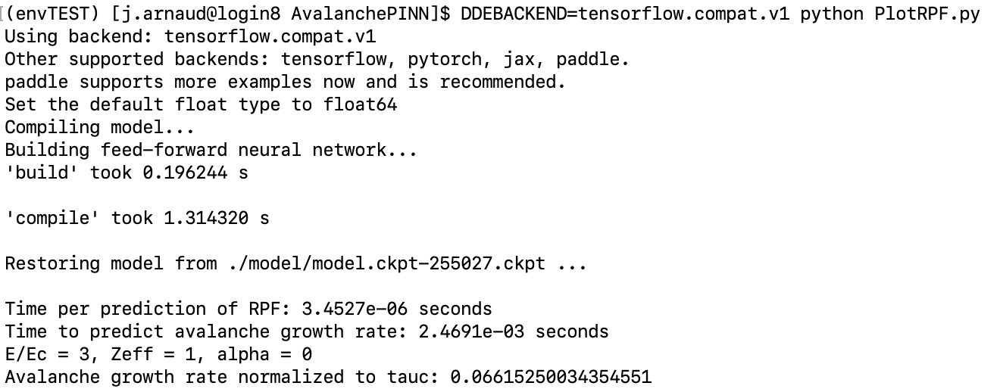

** UNDER CONSTRUCTION **

This directory contains a physics informed neural network (PINN) that predicts the parametric dependence of the exponential "avalanche" growth rate of relativistic electrons (runaway electrons, RE) $\gamma_{av}$, on the plasma's parallel electric field strength $E_\Vert$, effective charge $Z_{eff}$, and synchrotron radiation strength $\alpha$. Further details on the formulation of the PINN is found in the [paper](https://doi.org/10.1017/S0022377824000679). 

To launch the script that trains the PINN, simply run the command **DDEBACKEND=tensorflow.compat.v1 RPF_paper.py**, assuming the environment created in the parent directory of this repo is activated, and the **DDEBACKEND** must be **tensorflow.compat.v1**. **If the directory "model" is not created in the working directory, the script will throw an error when saving the model during training**. If the correct libraries and modules are not loaded, the script will typically either throw an error or run inefficiently (i.e the GPU will not be utilized). An example of what the output should look like is shown below:

Once the PINN has trained. Run the following command **DDEBACKEND=tensorflow.compat.v1 RPF_paper.py** to compute the RPF, residual, and avalanche growth rate for a chosen set of paramters $E_\Vert$,$Z_{eff}$,$\alpha$. The time per prediction in computing the RPF and the time taken to evaluate the avalanche growth rate is also computed. An example output of the plotting script is shown below:

