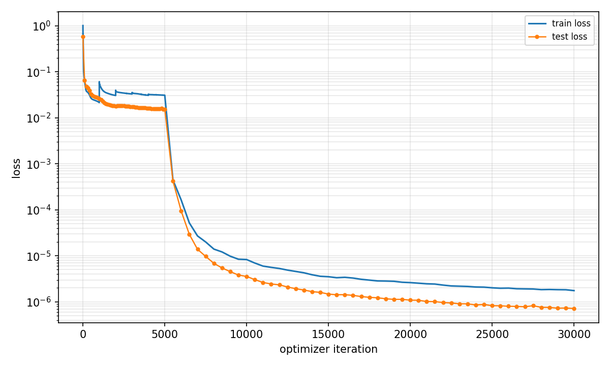
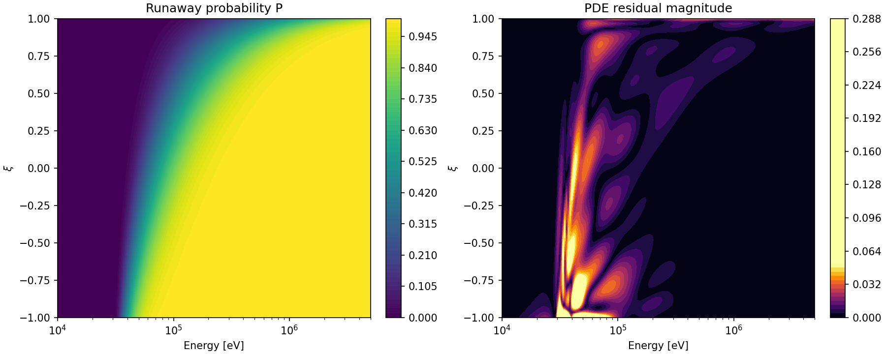

# Parametric runaway probability function PINN demo

This demo trains and deploys a physics-informed neural network (PINN) for a steady runaway probability function (RPF) in normalized momentum and pitch-angle coordinates. The parametric model learns

\[
P = P(p,\xi; |E_\phi|, Z_\mathrm{eff}, \alpha),
\]

where `p` is relativistic momentum, `xi` is pitch-angle cosine, `|E_phi|` is the normalized electric-field magnitude, `Zeff` is the effective charge, and `alpha` controls the radiation-reaction contribution.

## Physical model

The PINN solves the steady Fokker-Planck-type residual used in `RPF_test.py`. With

\[
\gamma = \sqrt{1+p^2}, \qquad C_F = \frac{\gamma^2}{p^2}, \qquad C_B = \frac{Z_\mathrm{eff}+1}{2}\frac{\gamma}{p},
\]

the residual is

\[
R = \frac{1}{C_F |E_\phi|}\left(E^* + C^* + R^*\right),
\]

where

\[
E^* = |E_\phi|\left[\xi P_p + \frac{1-\xi^2}{p}P_\xi\right],
\]

\[
C^* = C_F P_p - \frac{C_B}{p^2}\left[(1-\xi^2)P_{\xi\xi} - 2\xi P_\xi\right],
\]

and

\[
R^* = \alpha\left[\gamma p(1-\xi^2)P_p - \frac{\xi(1-\xi^2)}{\gamma}P_\xi\right].
\]

The low-energy boundary is hard-enforced through the output transform. By default,

\[
P(p_\mathrm{norm},\xi,\theta) = p_\mathrm{norm}\,\sigma(N_\theta),
\]

so that `P=0` at `p_norm=0`. The high-energy boundary is imposed as a soft constraint. At `p=p_max`, the target is

\[
P(p_\max,\xi)=1
\]

on the part of the boundary where the momentum-space velocity

\[
U_p = -\xi |E_\phi| - C_F - \alpha \gamma p(1-\xi^2)
\]

is positive. The critical pitch angle satisfying `U_p=0` is computed analytically and the high-energy boundary loss samples `xi` over the interval `[-1, xi_crit]`.

## Training

Edit the top-level configuration blocks in the training scripts and run one of:

```bash
python train_rpf_fixed_jax.py
python train_rpf_parametric_jax.py
```

The fixed script trains one parameter setting and saves diagnostics only. The parametric script trains the model used by the browser GUI and exports the ONNX models.

The main files written by training are:

```text
models/loss_history.png
models/loss_history.csv
models/loss_history.json
models/training_results.png
models/rpf_forward.onnx
models/rpf_residual.onnx
models/metadata.json
```

## Loss history

After training, the loss history plot is written here:



## Training result

The training-result figure shows the learned probability and PDE residual for a representative parameter setting:



## Interactive GUI

[Open the interactive RPF PINN demo](https://cmcdevitt2.github.io/RunAwayPINNs/DeepRunAway/demo/)

The GUI exposes sliders for `|E_phi|`, `Zeff`, and `alpha`, plus grid-resolution and backend controls. It displays the predicted runaway probability and the corresponding PDE residual.
