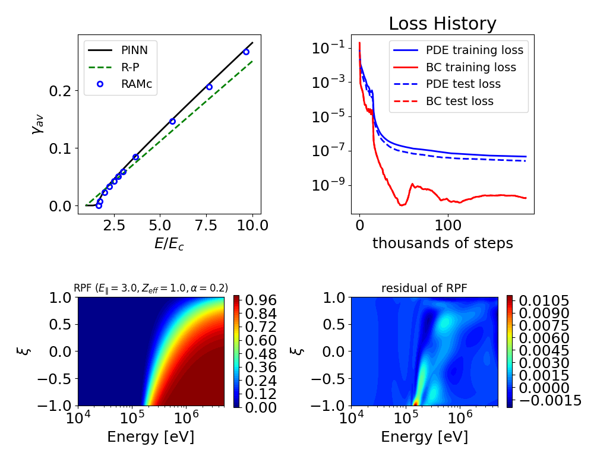

# AvalanchePINN
This directory contains a physics-informed neural network (PINN) that predicts the parametric dependence of the exponential "avalanche" growth rate of relativistic electrons (runaway electrons, RE) $\gamma_{av}$, on the plasma's parallel electric field strength $E_\Vert$, effective charge $Z_{eff}$, and synchrotron radiation strength $\alpha$. Further details on the formulation of the PINN is found in the [paper](https://doi.org/10.1017/S0022377824000679). 

We note that due to the decreasing support of Tensorflow ([Nvidia no longer will provide pre-built containers](https://docs.nvidia.com/deeplearning/frameworks/tensorflow-release-notes/rel-25-02.html)), we have gone ahead and converted the backend of the PINN script from Tensorflow to PyTorch, which does not impact the overall performance, as simple tensor operations are done for this script, and the L-BFGS-B optimizer is from Scipy, which is independent of the backend.

# Getting started and example solution
To launch the script that trains the PINN, simply run the command ```DDEBACKEND=pytorch python TrainAvalanchePINN.py```, assuming the environment created in the parent directory of this repo is activated. Assuming the existing script is ran exactly as is, an example solution is shown below, where this example trained till $\approx$ 188,000 iterations. Here, the first 15,000 iterations are with the ADAM optimizer, and the remaining iterations are with the L-BFGS-B optimizer. We note that the example script uses approximately 41 GB of GPU memory, so please use a GPU that has sufficient memory to run the script as is. Below is part of the output of the training script:
````
u0001781@qc-gh200-02:~/git_home/RunAwayPINNs/Surrogates/AvalanchePINN$ DDE_BACKEND=pytorch python TrainAvalanchePINN.py 
Using backend: pytorch
Other supported backends: tensorflow.compat.v1, tensorflow, jax, paddle.
paddle supports more examples now and is recommended.
Set the default float type to float64
Warning: 1000000 points required, but 1194102 points sampled.
Compiling model...
'compile' took 1.471235 s

Training model...

Step      Train loss              Test loss               Test metric
0         [7.84e-02, 2.00e-01]    [7.31e-02, 2.00e-01]    []  
1000      [1.14e-02, 8.26e-04]    [5.66e-03, 8.26e-04]    []  
2000      [7.86e-03, 4.90e-04]    [3.47e-03, 4.90e-04]    []  
3000      [5.57e-03, 3.45e-04]    [2.59e-03, 3.45e-04]    []  
4000      [3.64e-03, 2.16e-04]    [1.76e-03, 2.16e-04]    []  
5000      [2.41e-03, 8.31e-05]    [1.12e-03, 8.31e-05]    []  
6000      [1.74e-03, 4.68e-05]    [8.38e-04, 4.68e-05]    []  
7000      [1.32e-03, 4.78e-05]    [7.29e-04, 4.78e-05]    []  
8000      [8.15e-04, 2.80e-05]    [3.61e-04, 2.80e-05]    []  
9000      [6.08e-04, 2.09e-05]    [2.66e-04, 2.09e-05]    []  
10000     [5.55e-04, 2.80e-05]    [3.12e-04, 2.80e-05]    []  
11000     [4.35e-04, 1.76e-05]    [2.49e-04, 1.76e-05]    []  
12000     [2.68e-04, 2.66e-05]    [1.25e-04, 2.66e-05]    []  
13000     [2.60e-04, 1.33e-05]    [1.40e-04, 1.33e-05]    []  
14000     [3.35e-04, 2.34e-05]    [1.36e-04, 2.34e-05]    []  
15000     [2.05e-04, 1.05e-05]    [1.07e-04, 1.05e-05]    []  

Best model at step 15000:
  train loss: 2.15e-04
  test loss: 1.18e-04
  test metric: []

Epoch 15000: saving model to ./model.ckpt-15000.pt ...

'train' took 1602.828223 s

Saving loss history to /home/users/u0001781/git_home/RunAwayPINNs/Surrogates/AvalanchePINN/loss.dat ...
Saving training data to /home/users/u0001781/git_home/RunAwayPINNs/Surrogates/AvalanchePINN/train.dat ...
Saving test data to /home/users/u0001781/git_home/RunAwayPINNs/Surrogates/AvalanchePINN/test.dat ...
Compiling model...
'compile' took 0.000170 s

Training model...

Step      Train loss              Test loss               Test metric
15000     [2.05e-04, 1.05e-05]    [1.07e-04, 1.05e-05]    []  
16000     [1.85e-05, 3.62e-07]    [1.08e-05, 3.62e-07]        
17000     [8.20e-06, 1.61e-07]    [4.73e-06, 1.61e-07]        
18000     [5.07e-06, 1.00e-07]    [2.83e-06, 1.00e-07]        
19000     [3.39e-06, 6.28e-08]    [1.94e-06, 6.28e-08]        
20000     [2.55e-06, 4.45e-08]    [1.38e-06, 4.45e-08]        
21000     [1.95e-06, 3.08e-08]    [1.06e-06, 3.08e-08]        
22000     [1.48e-06, 2.11e-08]    [7.82e-07, 2.11e-08]        
23000     [1.18e-06, 1.67e-08]    [6.26e-07, 1.67e-08]        
24000     [9.74e-07, 1.16e-08]    [5.41e-07, 1.16e-08]        
25000     [8.34e-07, 9.88e-09]    [4.61e-07, 9.88e-09]        
26000     [7.29e-07, 8.20e-09]    [3.98e-07, 8.20e-09]        
27000     [6.38e-07, 4.32e-09]    [3.56e-07, 4.32e-09]        
28000     [5.69e-07, 3.92e-09]    [3.16e-07, 3.92e-09]        
29000     [5.12e-07, 2.63e-09]    [2.78e-07, 2.63e-09]        
30000     [4.64e-07, 2.02e-09]    [2.53e-07, 2.02e-09]        
31000     [4.23e-07, 2.22e-09]    [2.30e-07, 2.22e-09]        
32000     [3.87e-07, 1.50e-09]    [2.10e-07, 1.50e-09]        
33000     [3.60e-07, 1.06e-09]    [1.89e-07, 1.06e-09]        
34000     [3.36e-07, 9.44e-10]    [1.74e-07, 9.44e-10]        
35000     [3.15e-07, 7.42e-10]    [1.60e-07, 7.42e-10]        
36000     [2.98e-07, 5.80e-10]    [1.52e-07, 5.80e-10]        
37000     [2.82e-07, 4.78e-10]    [1.41e-07, 4.78e-10]        
38000     [2.67e-07, 3.69e-10]    [1.32e-07, 3.69e-10]        
39000     [2.55e-07, 2.78e-10]    [1.27e-07, 2.78e-10]        
40000     [2.44e-07, 2.21e-10]    [1.21e-07, 2.21e-10]        
41000     [2.34e-07, 1.77e-10]    [1.16e-07, 1.77e-10]        
42000     [2.26e-07, 1.72e-10]    [1.11e-07, 1.72e-10]        
43000     [2.17e-07, 1.47e-10]    [1.05e-07, 1.47e-10]        
44000     [2.10e-07, 9.24e-11]    [1.04e-07, 9.24e-11]        
45000     [2.03e-07, 8.37e-11]    [9.94e-08, 8.37e-11]        
46000     [1.97e-07, 6.61e-11]    [9.54e-08, 6.61e-11]        
47000     [1.91e-07, 6.69e-11]    [9.32e-08, 6.69e-11]        
48000     [1.85e-07, 6.38e-11]    [9.34e-08, 6.38e-11]        
49000     [1.80e-07, 6.78e-11]    [9.01e-08, 6.78e-11]        
50000     [1.74e-07, 7.02e-11]    [8.69e-08, 7.02e-11]        
51000     [1.70e-07, 7.26e-11]    [8.57e-08, 7.26e-11]        
52000     [1.66e-07, 7.51e-11]    [8.33e-08, 7.51e-11]        
53000     [1.62e-07, 9.67e-11]    [8.15e-08, 9.67e-11]        
54000     [1.58e-07, 1.27e-10]    [7.92e-08, 1.27e-10]        
55000     [1.54e-07, 1.79e-10]    [7.77e-08, 1.79e-10]        
56000     [1.50e-07, 2.74e-10]    [7.77e-08, 2.74e-10]        
57000     [1.47e-07, 4.87e-10]    [7.53e-08, 4.87e-10]        
58000     [1.43e-07, 6.67e-10]    [7.33e-08, 6.67e-10]        
59000     [1.39e-07, 9.76e-10]    [7.04e-08, 9.76e-10]        
59912     [1.36e-07, 1.16e-09]    [6.88e-08, 1.16e-09]    []  

Best model at step 59912:
  train loss: 1.37e-07
  test loss: 7.00e-08
  test metric: []

Epoch 59912: saving model to ./model.ckpt-59912.pt ...

'train' took 10575.371599 s

Saving loss history to /home/users/u0001781/git_home/RunAwayPINNs/Surrogates/AvalanchePINN/loss.dat ...
Saving training data to /home/users/u0001781/git_home/RunAwayPINNs/Surrogates/AvalanchePINN/train.dat ...
Saving test data to /home/users/u0001781/git_home/RunAwayPINNs/Surrogates/AvalanchePINN/test.dat ...
````


Once the PINN has trained. Run the following command ```DDEBACKEND=pytorch python PredictAvalanchePINN.py``` to compute the RPF, residual, and avalanche growth rate for a chosen set of paramters $(E_\Vert,Z_{eff},\alpha)$. The time per prediction in computing the RPF and the time taken to evaluate the avalanche growth rate is also computed. An example output of the plotting script is shown below:

```
u0001781@qc-gh200-02:~/git_home/RunAwayPINNs/Surrogates/AvalanchePINN$ DDE_BACKEND=pytorch python PredictAvalanchePINN.py 
Using backend: pytorch
Other supported backends: tensorflow.compat.v1, tensorflow, jax, paddle.
paddle supports more examples now and is recommended.
Set the default float type to float64
Compiling model...
'compile' took 0.000131 s

Restoring model from ././model.ckpt-188510.pt ...

E/Ec = 3.0, Zeff = 1.0, alpha = 0.2
Avalanche growth rate normalized to tauc: 0.059932555194978095, time to predict: 54.28 ms
Time per prediction of RPF: 1.3136e-07 seconds
```
Example outputs saved from the plotting script are shown below:

