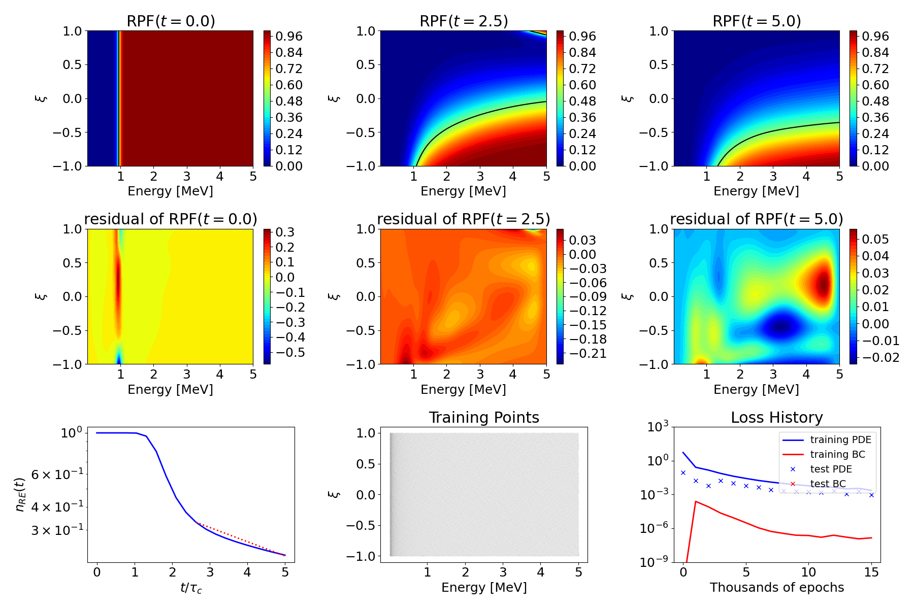

# DecayPINN
This directory contains a physics-informed nerual network (PINN) that predicts the evolution of the number of runaway electrons, yielding a runaway electron decay rate. The PINN predicts this quantity over a range of electric fields $E_\Vert$, effective charges $Z_{eff}$, and synchrotron radiation strenghts $\alpha$. Further details on the formulation of the PINN is found in the [paper](https://doi.org/10.1063/5.0253370). 

We note that due to the decreasing support of Tensorflow ([Nvidia no longer will provide pre-built containers](https://docs.nvidia.com/deeplearning/frameworks/tensorflow-release-notes/rel-25-02.html)), we have gone ahead and converted the backend of the PINN script from Tensorflow to PyTorch, which does not impact the overall performance, as simple tensor operations are done for this script, and the L-BFGS-B optimizer is from Scipy, which is independent of the backend.

# Getting started and example solution
To launch the script that trains the PINN, simply run the command ```DDE_BACKEND=pytorch python TrainDecayPINN.py```, assuming the environment created in the parent directory is created. Assuming the existing script is ran exactly as is, an example solution is shown below, where the PINN trained for 25,000 iterations. Here, the first 15,000 iterations are with the ADAM optimizer, and the remaining 10,000 iterations are with the L-BFGS-B optimizer. We note that the example script uses approximately 10 GB of GPU memory,
so please use a GPU that has sufficient memory to run the script as is. Below is an output of the training script:

```
Using backend: pytorch
Other supported backends: tensorflow.compat.v1, tensorflow, jax, paddle.
paddle supports more examples now and is recommended.
Set the default float type to float64
Warning: 633 points required, but 1792 points sampled.
Warning: 200000 points required, but 566272 points sampled.
Compiling model...
'compile' took 0.986356 s

Training model...

Step      Train loss              Test loss               Test metric
0         [5.19e+00, 7.22e-12]    [8.42e-02, 7.22e-12]    []  
1000      [2.54e-01, 2.40e-04]    [1.69e-02, 2.40e-04]    []  
2000      [1.44e-01, 8.09e-05]    [5.94e-03, 8.09e-05]    []  
3000      [7.24e-02, 2.18e-05]    [1.64e-02, 2.18e-05]    []  
4000      [4.12e-02, 8.47e-06]    [1.03e-02, 8.47e-06]    []  
5000      [2.61e-02, 3.07e-06]    [6.09e-03, 3.07e-06]    []  
6000      [1.73e-02, 1.09e-06]    [4.17e-03, 1.09e-06]    []  
7000      [1.23e-02, 5.23e-07]    [2.72e-03, 5.23e-07]    []  
8000      [9.28e-03, 3.49e-07]    [2.19e-03, 3.49e-07]    []  
9000      [7.34e-03, 2.40e-07]    [1.94e-03, 2.40e-07]    []  
10000     [5.74e-03, 2.26e-07]    [1.69e-03, 2.26e-07]    []  
11000     [4.69e-03, 1.59e-07]    [1.54e-03, 1.59e-07]    []  
12000     [4.33e-03, 2.40e-07]    [2.16e-03, 2.40e-07]    []  
13000     [3.07e-03, 1.63e-07]    [1.09e-03, 1.63e-07]    []  
14000     [3.43e-03, 1.15e-07]    [1.90e-03, 1.15e-07]    []  
15000     [2.31e-03, 1.41e-07]    [9.36e-04, 1.41e-07]    []  

Best model at step 15000:
  train loss: 2.32e-03
  test loss: 9.36e-04
  test metric: []

Epoch 15000: saving model to ./model.ckpt-15000.pt ...

'train' took 288.245542 s

Saving loss history to /home/users/u0001781/RunAwayPINNs/Surrogates/DecayPINN/loss.dat ...
Saving training data to /home/users/u0001781/RunAwayPINNs/Surrogates/DecayPINN/train.dat ...
Saving test data to /home/users/u0001781/RunAwayPINNs/Surrogates/DecayPINN/test.dat ...
Compiling model...
'compile' took 0.000149 s

Training model...

Step      Train loss              Test loss               Test metric
15000     [2.31e-03, 1.41e-07]    [9.36e-04, 1.41e-07]    []  
```

Once the PINN has trained, run the following command ```DDE_BACKEND=pytorch python PredictDecayPINN.py``` to compute the RPF at different time slices, the corresponding PDE residual, evaluate the time trajectory of the number of runaway electrons, and evaluate the decay rate for a chosen set of parameters $(E_\Vert, Z_{eff}, \alpha)$. An example output of the plotting script is shown below:

```
Using backend: pytorch
Other supported backends: tensorflow.compat.v1, tensorflow, jax, paddle.
paddle supports more examples now and is recommended.
Set the default float type to float64
Compiling model...
'compile' took 0.000091 s

Restoring model from ././model.ckpt-15000.pt ...

Time per prediction of RPF: 2.3572e-06 seconds
Time per prediction of RPF: 1.0720e-06 seconds
Time per prediction of RPF: 1.0994e-06 seconds

Time to predict decay rate: 2.2447e-01 seconds
E/Ec = 1.5, Zeff = 2.0, alpha = 0.1
Decay growth rate normalized to tauc: -0.17639611300962102
```
Example outputs saved from the plotting script are shown below:
